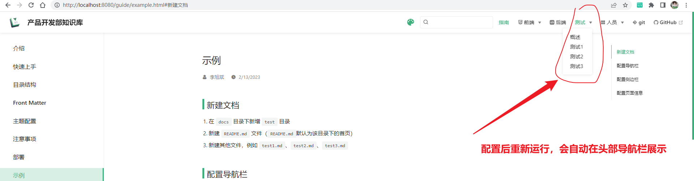
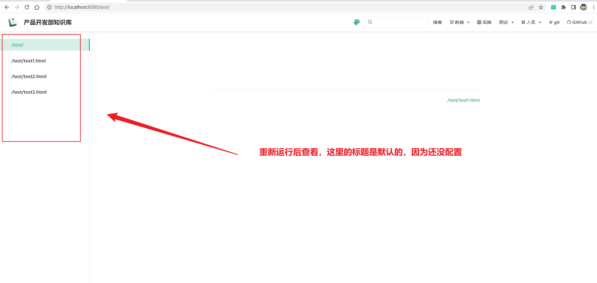
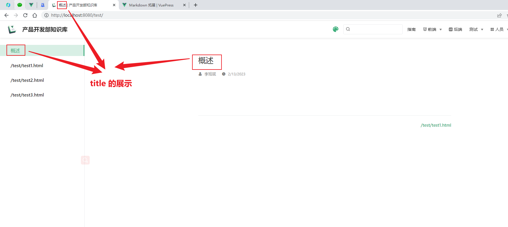

## 新建文档

1. 在 `docs` 目录下新增 `test` 目录
2. 新建 `README.md` 文件（`README.md`默认为该目录下的首页）
3. 新建其他文件，例如 `test1.md`、`test2.md`、`test3.md`

## 配置导航栏

* 导航栏是属于 `主题` 的配置，在 `docs/.vuepress/config/theme/nav/index.js` 文件中增加对应的配置。
* 示例如下：47 - 67 行的配置，配置后需要重新运行

```js {47-67}
// 导航栏

module.exports = [
  {
    text: '指南',
    link: '/guide/'
  },
  {
    text: '前端',
    icon: 'iconfont icon-html5',
    items: [
      {
        text: 'js',
        link: '/front/js/'
      },
      {
        text: 'css',
        link: '/front/css/'
      },
      {
        text: 'html',
        link: '/front/html/'
      },
      {
        text: 'vue2',
        link: '/front/vue2/'
      },
      {
        text: 'vue3',
        link: '/front/vue3/'
      },
      {
        text: 'uni-app',
        link: '/front/uni-app/'
      },
      {
        text: '微信小程序',
        link: '/front/weapp/'
      },
    ]
  },
  {
    text: '后端',
    link: '/back/',
    icon: 'reco-api'
  },
  {
    text: '测试',
    items: [
      {
        text: '概述',
        link: '/test/'
      },
      {
        text: '测试1',
        link: '/test/test-1/'
      },
      {
        text: '测试2',
        link: '/test/test-2/'
      },
      {
        text: '测试3',
        link: '/test/test-3/'
      },
    ]
  },
  {
    text: 'git',
    link: '/git/',
    icon: 'iconfont icon-git'
  },
  {
    text: 'GitHub',
    link: 'https://github.com/',
    icon: 'reco-github'
  },
]
```



## 配置侧边栏

* 侧边栏是属于 `主题` 的配置，在 `docs/.vuepress/config/theme/sidebar/index.js` 文件中增加对应的配置。
* 右侧的子侧边栏是页面的二级、三级标题自动生成的，不用配置
* 示例如下：13 - 18 行的配置，配置后需要重新运行

```js {13-18}
// 侧边栏（使用多侧边栏的方式）
module.exports = {
  '/guide/': [
    '',
    'getting-started',
    'directory-structure',
    'front-matter',
    'theme-config',
    'attention',
    'deploy',
    'example',
  ],
  '/test/': [
    '',
    'test1',
    'test2',
    'test3',
  ],
  '/front/js/': [
    '',
    {
      title: '数据类型',
      collapsable: true,
      children: [
        'types/',
        'types/null-undefined-boolean',
        'types/number',
        'types/string',
        'types/object',
        'types/function',
        'types/array',
      ]
    },
    {
      title: '运算符',
      collapsable: true,
      children: [
        'operators/arithmetic',
        'operators/comparison',
        'operators/boolean',
        'operators/bit',
        'operators/priority',
      ]
    },
    {
      title: '异步操作',
      collapsable: true,
      children: [
        'async/',
        'async/promise',
        'async/timer',
      ]
    },
  ],
}
```



## 配置页面信息

- 页面信息的一些配置，主要包括 `标题`、`作者`等，以 `docs/test/README.md` 为例
- title：作用于浏览器标签页的标题、左侧侧边栏的标题、文档的正文标题
- author：作者（可选配置）
- date：编写文档日期（可选配置）
- categories：主要用于对该人员文档的检索

```markdown
---
title: 概述
author: 李旭斌
date: 2023-02-13
categories:
 - 李旭斌
---
```




## 书写文档

- 正文标题已通过 `Front Matter` 中的 `title` 配置，所以在写文档时，标题最大从二级标题开始
- 二级标题、三级标题会自动展示在右侧子侧边栏中
- 文档使用 `markdown` 语法

```markdown
---
title: 概述
author: 李旭斌
date: 2023-02-13
categories:
- 李旭斌
---


## 二级标题1

内容....

## 二级标题2

内容....

## 二级标题3

内容....


...

```