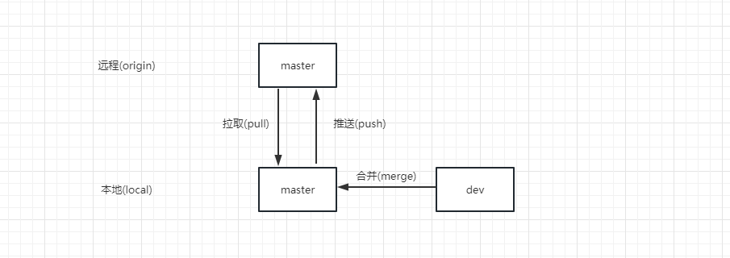

::: theorem
Git作为我们日常开发代码的版本管理，现在主流的分支模式主要有两种:**特性分支模式**(`Git-Flow,Github-Flow,Gitlab-Flow`)和**主干分支模式**,团队开发应根据实际情况选择适合的模式或者变体，不应拘泥于某一种开发模式，比如团队人员只有1-2人,版本发布频繁，就不要选择复杂的`Git-Flow`,反之团队人员有10人以上,采用主干模式会经常冲突，面临质量把控难等问题
:::
## 本地|远程

任何分支都可以有本地或者远程分支，并且可以**单独存在**，你自己可以在本地创建无数的分支，做各种提交合并操作但不推送，但是对其他人来说这是不可见的

## 主动合代码(分支合并)

一个分支可以合并(`merge`)到另一个分支
一般来说,除了需要`merge quest`的保护分支，一般的分支我们在本地进行分支合并，本地合并完后讲合并之后的分支推送到远程分支，不要在远程进行合并操作

## 被动合代码(拉取和推送)

拉取代码和推送代码其实是同名分支的合并，实际开发中**禁止非同名**的本地远程分支进行拉取和推送

## 冲突的发生

主动和被动合代码过程都有可能导致冲突发生
