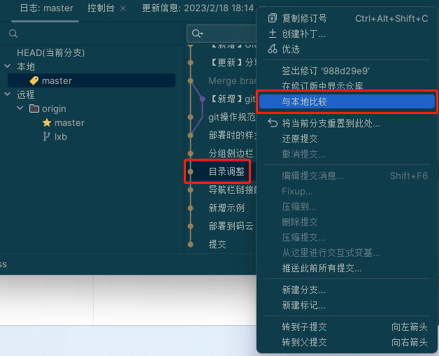

常见客户端工具： `sourcetree` `github desktop` `Tortoisegit`

因为Idea/Webstorm的`git`操作已经无比强大，本文将以`Idea`演示`Git`各种操作，可搭配上面的工具进行`git`操作

## 初始化git版本库(` git init`)

1. 在线上(云效|gitee)创建项目，git地址
2. 用Idea打开要进行git管理的文件夹或项目
3. 点击`VCS->新建git仓库`,此时可看到出现隐藏文件夹.git，同时Idea设置中选项以由`VCS`变为`Git`，本地也出现了`master`主分支

4. 点击新出现的`Git->管理远程`，在弹出框，名称写入：`origin`,url写入线上git地址

5.打开git操作界面，右键点击`master`分支，进行推送
:::danger
推送前一定要加入.gitignore文件,过滤不需要维护的文件
:::

## 从已有git线上地址克隆代码( `git clone http://xxx`)

## 拉取代码(`git pull`)

## 提交和推送代码（`git commit|git push`）

## 回滚(`roll back`)

## 切换分支(`check out`)

将某个分支同步到本地代码,右键点击要切换的分支进行签出操作，如果是远程分支，将自动在本地同步同名分支

## 合并冲突

## 查看某条记录修改的文件

:::theorem 常用操作项:
* 双击默认行文为查看和上个版本的文件对比
* 右键点击可选择和本地版本比较
* 迄今为止历史操作
* 可选择编辑源文件
:::

## 文件对比界面操作

:::theorem 常用操作选项:
* 可选择编辑源文件
* 收起为更改片段
* 如果是和本地文件对比,则可以直接操作本地文件
:::

## 提交记录对比操作

任选两条记录,右键选择比较版本,左侧出现版本文件对比,双击文件可出现文件变化

## 与本地比较 -划重点

:::theorem 使用场景:
* 如果之前的某条提交记录里有代码想拿到本地复用,或者某部分代码想回到之前的某个状态
* 远程的某条记录的某个代码想应用到本地，
:::

1.右键点击记录，选择与本地比较

2.左侧会出现文件变化记录,颜色代表本地相对于素选记录的变化,**绿色代表新增,灰色为删除,蓝色为修改**

:::danger
绿色代表新增的，**不要操作**(操作无意义)
:::
灰色代表本地删除的,一般操作是右键 -> **点击获取**

蓝色代表有变化，一般操作是 **双击点开**,选择具体行进行操作

## 本地提交后取消提交

右键点击上一条提交记录，选择 **将当前分支重置到此处->混合**

## 本地文件整体回到某条记录

1. 先保证本地记录无修改，右键点击要回到的记录，选择 **将当前分支重置到此处->硬**
2. 在右键点击最新的记录 选择 **将当前分支重置到此处->混合**,最后推送本地修改到远程
