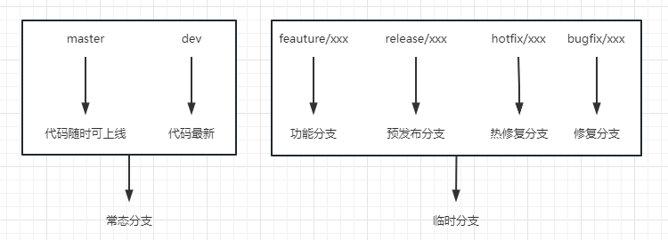
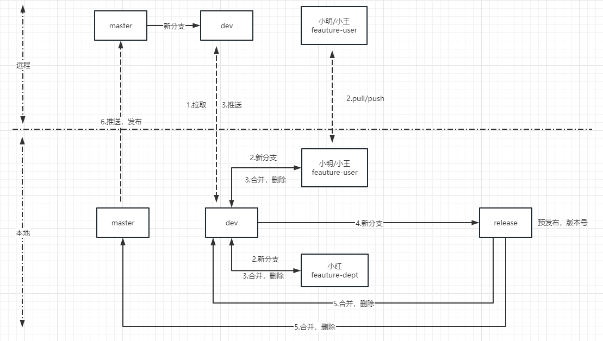

本文选取有代表性的`Git-Flow`进行介绍，公司实际使用分支规范[点击跳转](/standard/)

`Git-Flow`版本管理流程中，分支大致可以分为两大类，常态分支和临时分支

### **常态分支（一直存在，而且只有一个）**

1. `master`: 生产环境的稳定分支
   * 分支代码随时可上线
   * 仅在发布可部署代码时才更新master分支
   * 只能被release分支或hotfix分支合并
2. `develop`: 开发主分支
   * 包含正在开发的所有新特性
   * `develop`分支衍生出各个`feature`分支

### **临时分支（临时创建，使命完成后进行删除）**

1. `feature`：为了开发某个特定功能，从develop分支上面分出来的。开发完成后，要merge到develop分支，merge之后要进行删除

   * 命名规则：`feature/*`
   * 每个`feature`分支颗粒尽量小，以利于快速迭代和避免冲突
   * 当其中一个`feature`分支完成后，合并回develop分支，并且删除此`feature`分支
   * `feature`分支可只`commit`到本地git库，不进行远程推送
   * `feature`分支只和develop分支交互
2. `release`：预发布分支

   * `release`分支主要用来为发布新版的测试，分支允许做小的缺陷修正
   * 当`develop`分支上的代码已经包含了所有即将发布的版本中所有功能，并且已经通过所有测试时，我们就可以考虑创建`release`分支
3. `hotfix`：为紧急修复`master`分支上的错误分出来的修复分支

   * `hotfix`分支用来快速给已发布产品修复bug或微调功能
   * `从master`分支衍生而来
4. `bugfix`：dev分支上修复bug创建的分支,类似`feature`

## 流程介绍

0. 一个项目首先会创建出初始`master`和`dev`分支
1. 开发人员将dev分支签出(`checkout`)拉到本地
2. 开发人员按照要开发的功能从dev分支新建出`feature`新分支，一个`feature`功能如果是多人协作开发，需要把此`feature`分支推送到远程，如果是单人开发，无需提交到远程，只在本地`commit`即可
3. `feature`分支功能开发完毕后，将`feature`合并到dev分支并推送，**`删除feature分支`**
4. 当`dev`分支包含所有功能时，并且开发人员做完开发测试工作后，开发进行提测阶段，从`dev`分支新建新`release`预发布分支，做版本发布准备
5. `release`分支合并回`master`分支和`dev`分支(如果`master`为保护分支，需要管理员进行`maseter`的合并)，**`删除release分支`**
6. `master`分支进行远程推送，正式发布到正式服
