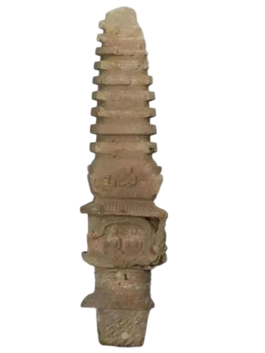

## 基本符号
md文档中基本标记都是基于 * - +. > 这几个符号的组合操作。注意符号后面都要有一个用于分割符号与内容的空格。

## 标题

 + 文字

``` sh

# 标题1 #
## 标题2 ##
### 标题3 ###
#### 标题4 ####
##### 标题5 #####
###### 标题6 #######

```
效果

# 标题1 #
## 标题2 ##
### 标题3 ###
#### 标题4 ####
##### 标题5 #####
###### 标题6 #######

## 列表

## 无序列表

```sh
+ a
+ b
+ c
 
- d
- e
- f
 
* g
* h
* i

```

效果

+ a
+ b
+ c
 
- d
- e
- f
 
* g
* h
* i

## 有序列表

```sh 
有序列表
1. abc
2. abc
3. dada
 
错序列表
2. awfa
5. awef
25. dfaf
```
效果

有序列表
1. abc
2. abc
3. dada
 
错序列表

2. awfa
5. awef
25. dfaf

## 嵌套列表

```sh
无序
+ a
  + a1
  + a2
+ ba
+ c
 
有序
1. a
   1. adac
      1. adaw
   2. adfsda
2. ad
3. sad
```
效果

无序
+ a
  + a1
  + a2
+ ba
+ c
 
有序
1. a
   1. adac
      1. adaw
   2. adfsda
2. ad
3. sad

## 代码块

```sh
代码块

`
adaawf
`

多行代码块儿

\```sh 
adaawfwrfwr
\```

```
效果

代码块-----
`
adaawf
`

多行代码块儿
```
adaawfwrfwr
jfdklsjalfsdj
dsjfklajf 
dfjslkajfkl
```

## 链接

```sh
链接
[百度1](www.baidu.com)
```
效果

//链接
[百度1](http://www.baidu.com)


## 图片

```sh


```
效果


## 表格

```
表格
|123|234|345|
|:-|:-:|-:|
|abc|bcd|cde|
|abc|bcd|cde|
|abc|bcd|cde|
|abc|bcd|cde|
|abc|bcd|cde|
//例子二
|123|234|345|
|:---|:---:|---:|
|abc|bcd|cde|
|abc|bcd|cde|
|abc|bcd|cde|
//例子三
123|234|345
:-|:-:|-:
abc|bcd|cde
abc|bcd|cde
abc|bcd|cde

```

效果

表格
|123|234|345|
|:-|:-:|-:|
|abc|bcd|cde|
|abc|bcd|cde|
|abc|bcd|cde|
|abc|bcd|cde|
|abc|bcd|cde|
//例子二
|123|234|345|
|:---|:---:|---:|
|abc|bcd|cde|
|abc|bcd|cde|
|abc|bcd|cde|
//例子三
123|234|345
:-|:-:|-:
abc|bcd|cde
abc|bcd|cde
abc|bcd|cde


## 分割线

```sh

分割线
---
- - -
-------
*****
* * *
____

```

效果


---
- - -
-------
*****
* * *
____


## 其他

```sh
//斜体
*md*
 
//粗体
**md**
 
//斜体
_md_
 
//斜体
__md__
 
//转义
 
\+
 
//删除线
 
~~删除~~
```

效果

//斜体
*md*
 
//粗体
**md**
 
//斜体
_md_
 
//斜体
__md__
 
//转义
 
\+
 
//删除线
 
~~删除~~

