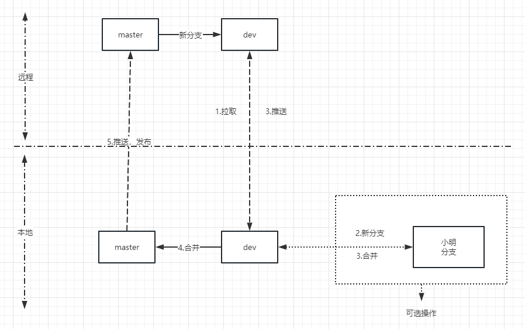

根据团队实际情况,我们采用如下分支模式,建议查看规范前先查看[Git分支介绍](/share/git/)

## master分支:

* 初始化仓库时创建
* `master`设置为**保护分支**,设置为只允许管理员推送,这个版本库的主要开发者为这个库的管理员
* 管理员负责从本地`dev`分支->合并到`master`分支并推送
* 因为不直接在此分支开发，本分支不会有冲突处理

## dev分支:

* 初始化仓库时创建
* 简单功能或者没什么冲突的功能可以直接在此分支上进行开发
* 一般功能建议本地衍生`feature`分支,`feature`分支开发完毕后合并到dev,并且**删除此`feature`分支**
* 开发人员测试，测试服预发布测试都在此分支进行

## feature分支:

* 命名规则 `feature-功能名`  如:`feature-login`
* 一般的`feature`分支建议只提交本地，不要推送到远程，除非是多人协作
* `feature`分支功能应**尽量颗粒化**，开发完一个功能，**尽早合并到dev**，并且删除此`feature`，避免长时间不提交导致版本冲突
