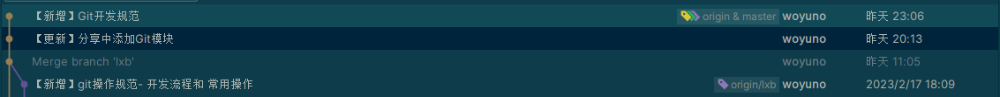

## 基本要求

* 所有commit必须有注释，内容须简洁明了的描述本次commit涵盖了哪些内容
* 合理控制提交内容的颗粒度，一次commit含一个功能点，**严禁长时间**一次提交涵盖多个功能点

## 提交日志规范

* 每次提交用【】 表明本次提交类型，后面跟本次提交内容，【】 的类型为【新增】【更新】【修复】【优化】
* 如一个版本库前后端都包括,则类型需要在前面指明后端还是前端 如:【后端-新增】 【前端-优化】

示例:

