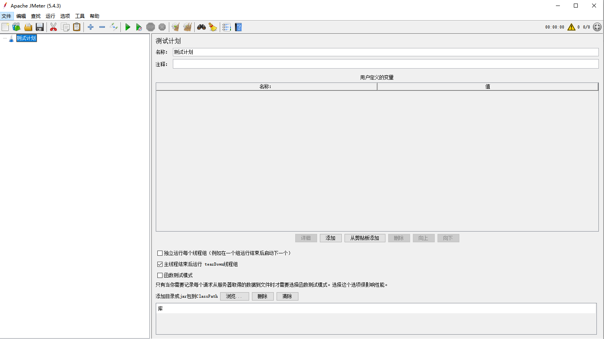

## 环境安装

1. 下载JMeter，到网站http://jmeter.apache.org/download_jmeter.cgi 去点击windows版本的zip下载版，最新3.2版本，需要JDK 1.8以上。

2. 安装JMeter，下载后解压zip包，解压出来发现不用安装，把这个文件放到一个位置，例如我放C盘根目录。

3. 启动JMeter，到C:\apache-jmeter-3.2\bin路径下，点击jmeter.bat文件，开始启动Jmeter.

启动好了的JMeter界面如下：

